# Bug Report

**MSSV:** 23127125  
**Họ và tên:** Nguyễn Hiếu Thuận  
**Bài tập:** HW02 - Domain Testing  
**Chức năng:** FR-02 (Đăng nhập & Khóa tài khoản)

---

## Danh sách Lỗi (Bugs) phát hiện được trên SUT

### 1. Bug 1: Sai logic khóa tài khoản (Khóa ở lần 2 thay vì lần 3)

- **Mô tả:** Theo đặc tả, tài khoản chỉ bị tạm khóa khi nhập sai từ 3 lần trở lên liên tiếp. Tuy nhiên, thực tế hệ thống đã khóa tài khoản ngay ở lần nhập sai thứ 2.
- **Test Case phát hiện:** `TC_FR-02_07`, `TC_FR-02_BVA_01`
- **GitHub Issue:** [Link Issue #1]
- **Ảnh minh chứng:**
  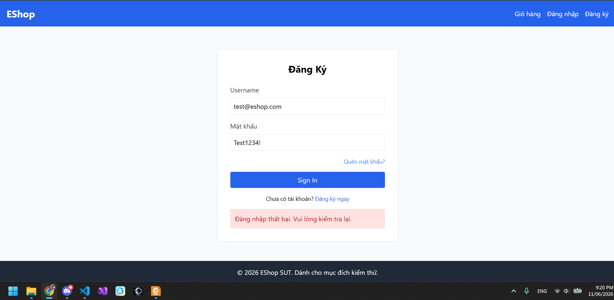

### 2. Bug 2: Không hiển thị thông báo "Tài khoản bị tạm khóa" (UI/UX)

- **Mô tả:** Khi tài khoản rơi vào trạng thái khóa, hệ thống không trả về thông báo lỗi chi tiết như yêu cầu ("Tài khoản bị tạm khóa 30s") mà chỉ hiển thị thông báo chung chung "Đăng nhập thất bại, vui lòng kiểm tra lại". Điều này gây hoang mang cho người dùng.
- **Test Case phát hiện:** `TC_FR-02_08`, `TC_FR-02_09`, `TC_FR-02_BVA_03`
- **GitHub Issue:** [Link Issue #2]
- **Ảnh minh chứng:**
  

### 3. Bug 3: Lỗi đồng bộ trạng thái Frontend (Phải F5 mới đăng nhập lại được)

- **Mô tả:** Sau khi hết thời gian phạt 30 giây, nếu người dùng tiếp tục nhấn nút Đăng nhập thì vẫn không thành công. Người dùng bắt buộc phải F5 (tải lại toàn bộ trang) thì mới có thể đăng nhập lại bình thường. Frontend không tự động reset state timeout.
- **Test Case phát hiện:** `TC_FR-02_02`, `TC_FR-02_BVA_05`, `TC_FR-02_BVA_06`
- **GitHub Issue:** [Link Issue #3]
- **Ảnh minh chứng:**
  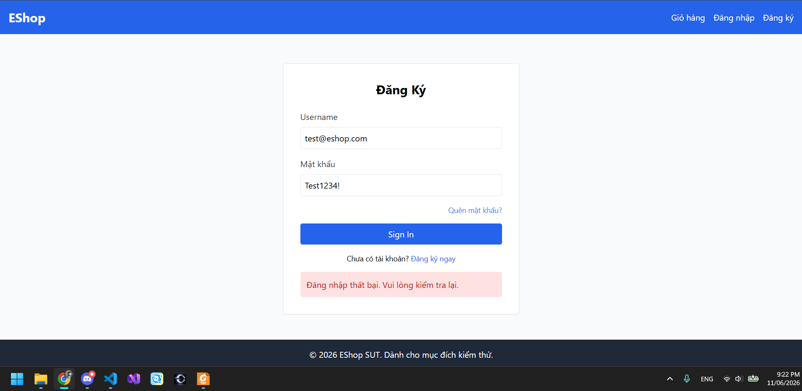

### 4. Bug 4: Thiếu Validation chuẩn HTML5 ở trường Email

- **Mô tả:** Ô nhập Email ở Frontend đang thiếu ràng buộc validate theo định dạng email chuẩn (ví dụ: thiếu ký tự `@` nhưng vẫn submit được). Form vẫn đẩy request sai định dạng xuống tận Backend xử lý thay vì chặn ngay tại UI.
- **Test Case phát hiện:** `TC_FR-02_04`
- **GitHub Issue:** [Link Issue #4]
- **Ảnh minh chứng:**
  

### 5. Bug 5: Sai thời gian phạt khóa tài khoản (Khóa 50s thay vì 30s)

- **Mô tả:** Theo đặc tả (FR-02), khi người dùng nhập sai quá số lần quy định, tài khoản sẽ bị tạm khóa trong **30 giây**. Tuy nhiên, thực tế kiểm thử cho thấy hệ thống từ chối đăng nhập ở các mốc 30s và 31s. Người dùng phải chờ đến hơn **50 giây** (và kết hợp tải lại trang) thì mới có thể đăng nhập lại thành công.
- **Test Case phát hiện:** `TC_FR-02_02`, `TC_FR-02_BVA_05`, `TC_FR-02_BVA_06`
- **GitHub Issue:** [Link Issue #5]
- **Ảnh minh chứng:**
  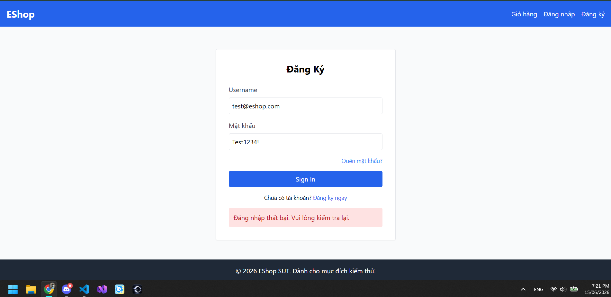

### 6. Bug 6: Không tự động xóa giỏ hàng sau khi thanh toán thành công

- **Mô tả:** Theo đặc tả, sau khi thanh toán thành công thì giỏ hàng phải được xóa. Tuy nhiên, thực tế sau khi thanh toán, nếu người dùng bấm lại vào Giỏ hàng thì các sản phẩm cũ vẫn còn nguyên. Người dùng thậm chí có thể thanh toán tiếp các món đồ này. Hệ thống chỉ thực sự xóa giỏ hàng nếu người dùng tự tải lại trang (reload/F5).
- **Test Case phát hiện:** `TC_FR-08_01`
- **GitHub Issue:** [Link Issue #6]
- **Ảnh minh chứng:**
  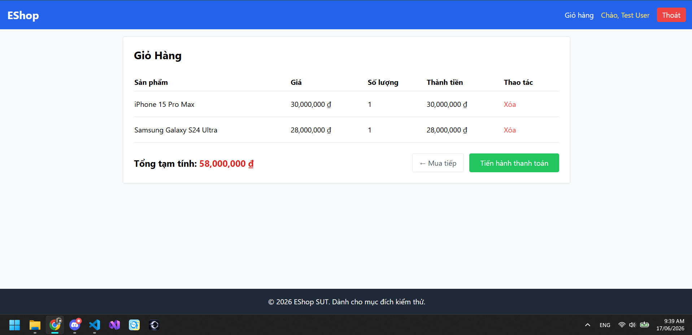

### 7. Bug 7: Lỗ hổng bảo mật cho phép thanh toán đơn hàng với giá 0 VNĐ

- **Mô tả:** Backend không thực hiện tính toán lại hoặc xác thực giá trị `total_amount` do Client gửi lên. Khi can thiệp sửa tổng tiền thành 0 trên UI (hoặc qua API), hệ thống vẫn chấp nhận và tạo đơn hàng thành công với tổng tiền 0đ.
- **Test Case phát hiện:** `TC_FR-08_02`
- **GitHub Issue:** [Link Issue #7]
- **Ảnh minh chứng:**
  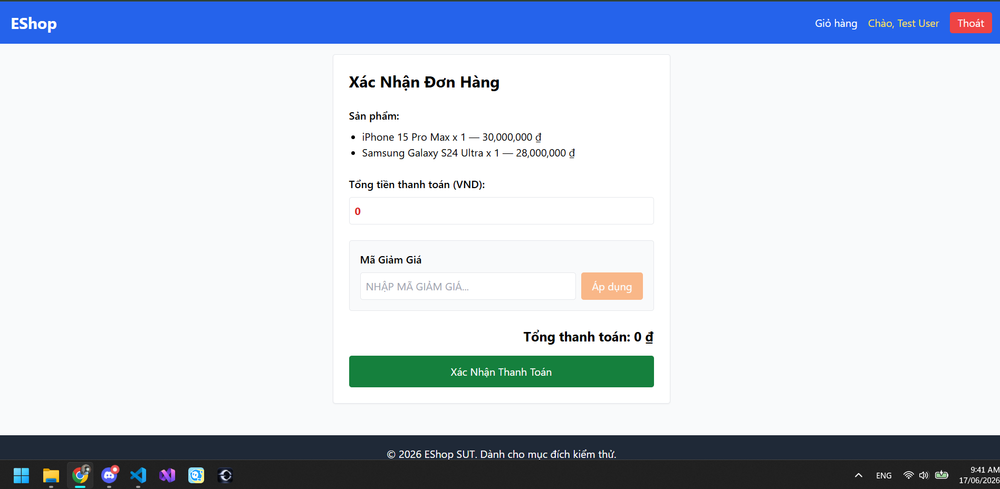

### 8. Bug 8: Lỗ hổng bảo mật cho phép thanh toán đơn hàng với giá trị âm

- **Mô tả:** Tương tự Bug 7, Backend thiếu validation hoàn toàn đối với trường `total_amount`. Người dùng có thể chỉnh sửa tổng tiền thành số âm (VD: -10đ) và hệ thống vẫn ghi nhận thanh toán thành công với đơn giá âm.
- **Test Case phát hiện:** `TC_FR-08_03`
- **GitHub Issue:** [Link Issue #8]
- **Ảnh minh chứng:**
  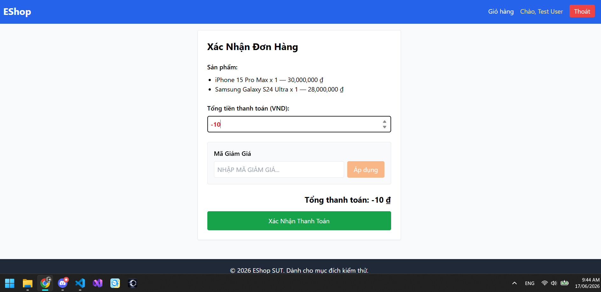

### 9. Bug 9: Lỗi cho phép thanh toán đơn hàng rỗng (Empty Cart)

- **Mô tả:** Sau khi ở trang thanh toán, nếu tải lại trang, danh sách sản phẩm biến mất (giỏ hàng rỗng) nhưng form thanh toán vẫn hiển thị với tổng tiền bằng 1 (hoặc 0). Nếu người dùng tiếp tục bấm thanh toán, hệ thống vẫn chấp nhận và tạo ra một đơn hàng "bóng ma" không có sản phẩm.
- **Test Case phát hiện:** `TC_FR-08_04`
- **GitHub Issue:** [Link Issue #9]
- **Ảnh minh chứng:**
  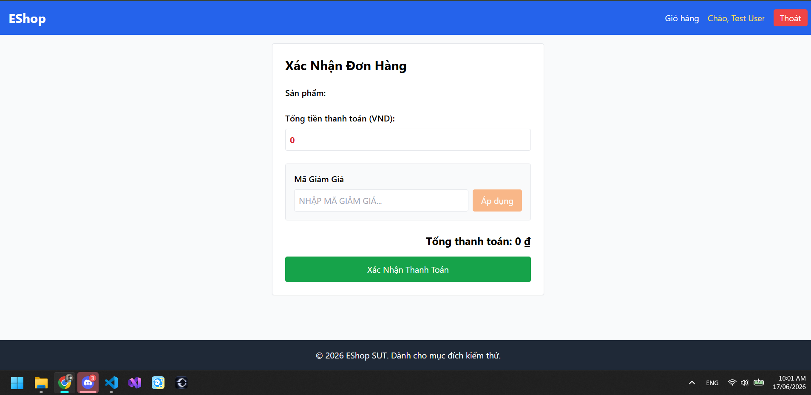

### 10. Bug 10: Lỗi cấu hình CORS Policy khi gọi API không có Token

- **Mô tả:** Khi gọi API Checkout (`POST /api/checkout`) mà xóa bỏ Header `Authorization`, thay vì trả về HTTP Status `401 Unauthorized` để Frontend xử lý, Backend lại gây ra lỗi sập luồng khiến trình duyệt văng lỗi CORS (Cross-Origin Resource Sharing) policy và `net::ERR_FAILED`.
- **Test Case phát hiện:** `TC_FR-08_07`
- **GitHub Issue:** [Link Issue #10]
- **Ảnh minh chứng:**
  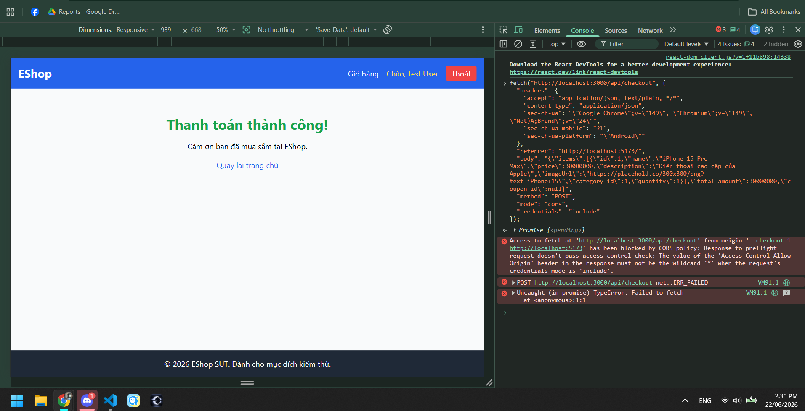

### 11. Bug 11: Lỗi cấu hình CORS Policy khi Token không hợp lệ

- **Mô tả:** Tương tự Bug 10, khi gửi request với Token bị cố tình chỉnh sửa sai chữ ký (không hợp lệ/hết hạn), Backend không trả về lỗi 401 mà tiếp tục gây ra lỗi CORS khiến trình duyệt chặn hoàn toàn request.
- **Test Case phát hiện:** `TC_FR-08_08`
- **GitHub Issue:** [Link Issue #11]
- **Ảnh minh chứng:**
  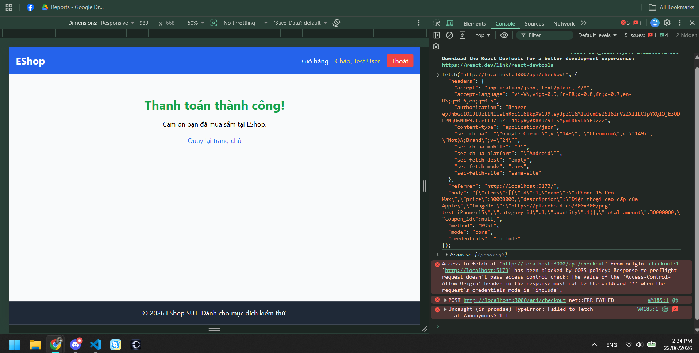

### 12. Bug 12: Lỗ hổng logic cho phép thanh toán sản phẩm với số lượng bằng 0

- **Mô tả:** Mặc dù số lượng sản phẩm đặt mua là 0 (không hợp lệ về mặt logic thương mại), hệ thống Backend vẫn không có cơ chế validation để chặn lại. Người dùng có thể điều chỉnh số lượng thành 0 và tiến hành thanh toán, hệ thống vẫn ghi nhận tạo đơn hàng thành công. _(Lưu ý: Khác với Bug 9 là gọi API với giỏ hàng rỗng hoàn toàn, lỗi này xảy ra khi giỏ hàng có tồn tại dữ liệu sản phẩm nhưng trường `quantity` của sản phẩm đó bằng 0)._
- **Test Case phát hiện:** `TC_FR-08_BVA_01`
- **GitHub Issue:** [Link Issue #12]
- **Ảnh minh chứng:**
  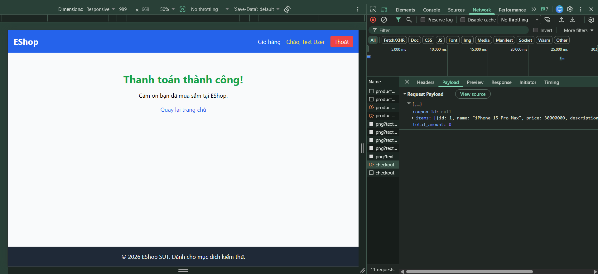

### 13. Bug 13: Lỗi logic tính toán sai (nhân đôi x2) Tổng doanh thu trên Dashboard

- **Mô tả:** Theo đặc tả của FR-13, hệ thống chỉ tính tổng `total_amount` của các đơn có `status = 'delivered'`. Tuy nhiên, hệ thống hiện đang bị lỗi logic trong quá trình cộng dồn dữ liệu (có thể do lỗi câu truy vấn SQL JOIN hoặc lỗi vòng lặp). Kết quả là giá trị doanh thu hiển thị trên giao diện Dashboard luôn luôn bị nhân đôi (x2) so với tổng số tiền thực tế của các đơn hàng thành công trong Database. Phép tính số âm vẫn hoạt động nhưng cũng bị nhân đôi.
- **Test Case phát hiện:** `TC_FR-13_02`, `TC_FR-13_04`, `TC_FR-13_06`
- **GitHub Issue:** [Link Issue #13]
- **Ảnh minh chứng:**
  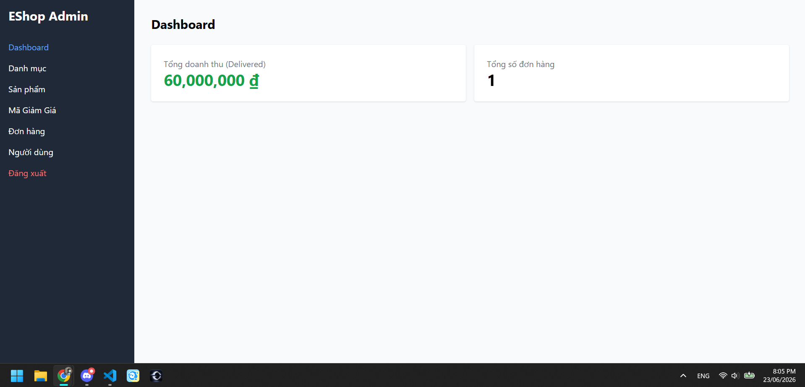

### 14. Bug 14: Giao diện thẻ Tổng doanh thu không responsive, bị vỡ layout khi số tiền quá lớn

- **Mô tả:** Khi tổng doanh thu đạt mức cực kỳ lớn (ví dụ: hàng trăm nghìn tỷ đồng, có thể xảy ra nhanh hơn do hệ thống đang mắc lỗi nhân đôi doanh thu), thẻ (Card) hiển thị Tổng doanh thu trên trang Dashboard không có cơ chế co giãn hoặc xử lý văn bản dài (truncate/format). Kết quả là dãy số bị tràn ra ngoài khung giới hạn của thẻ, đè lên các thành phần khác và gây vỡ layout (không responsive).
- **Test Case phát hiện:** `TC_FR-13_BVA_05`
- **GitHub Issue:** [Link Issue #14]
- **Ảnh minh chứng:**
  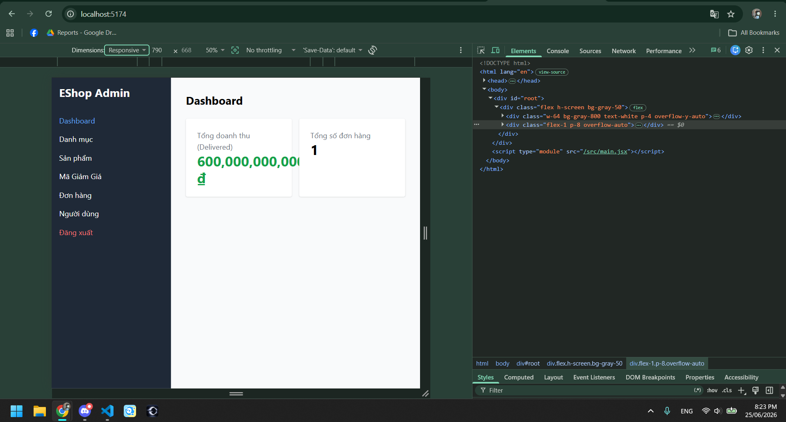

### 15. Bug 15: Giao diện thẻ Tổng số đơn hàng không responsive, bị vỡ layout khi số lượng cực lớn

- **Mô tả:** Tương tự như thẻ Tổng doanh thu, thẻ "Tổng số đơn hàng" cũng thiếu cơ chế thiết kế responsive. Mặc dù thực tế khó đạt được con số hàng triệu tỷ đơn hàng, nhưng khi mock dữ liệu để kiểm thử giới hạn hiển thị (BVA), dãy số lượng lớn (VD: 999.999.999.999.999) đã bị tràn ra khỏi khung chứa của thẻ, làm hỏng cấu trúc giao diện trang Dashboard.
- **Test Case phát hiện:** `TC_FR-13_BVA_06`
- **GitHub Issue:** [Link Issue #15]
- **Ảnh minh chứng:**
  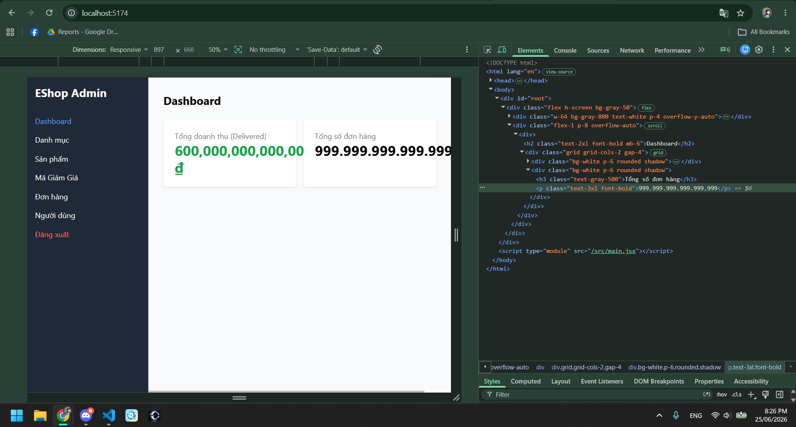
